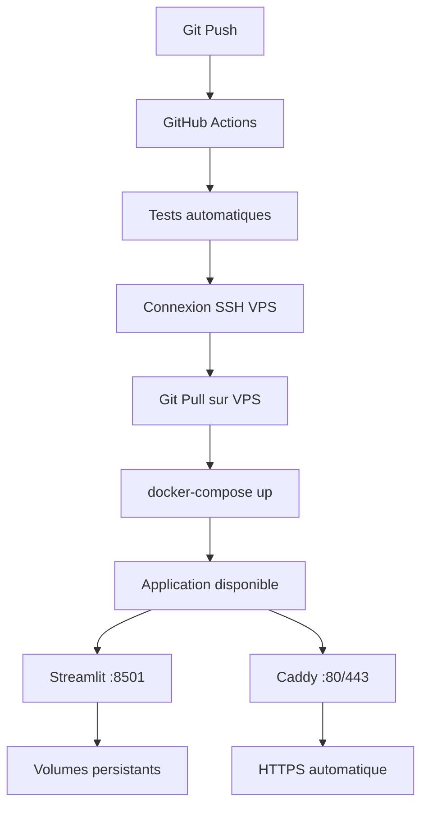

# 🚀 Guide de Déploiement - Aleou Extractor

**Architecture moderne avec déploiement automatique via GitHub Actions**

## 📋 Vue d'ensemble

Cette architecture simplifiée permet un déploiement **100% automatique** :
- 🔄 **Push → Déploiement** : Chaque push sur `main` déclenche automatiquement le déploiement
- 🐳 **Docker** : Application containerisée pour la portabilité
- 🔒 **Sécurisé** : Connexion SSH sécurisée, variables chiffrées
- ⚡ **Rapide** : Volumes Docker pour éviter les rebuilds

## 🛠️ PHASE 1 : Configuration initiale VPS

### 1. Prérequis serveur

```bash
# Connexion à votre VPS
ssh root@YOUR_VPS_IP

# Mise à jour système (Debian)
apt update && apt upgrade -y

# Installation Docker
curl -fsSL https://get.docker.com -o get-docker.sh
sh get-docker.sh

# Installation Docker Compose
apt install docker-compose-plugin -y

# Création utilisateur dédié
useradd -m -s /bin/bash -G docker aleou
su - aleou
```

### 2. Préparation du répertoire

```bash
# En tant qu'utilisateur aleou
mkdir -p /opt/aleou-extractor
cd /opt/aleou-extractor

# Test des permissions Docker
docker run hello-world
```

## 🔑 PHASE 2 : Configuration GitHub

### 1. Secrets GitHub requis

Dans votre repository GitHub, allez dans `Settings > Secrets and variables > Actions` :

| Secret | Description | Exemple |
|--------|-------------|---------|
| `VPS_HOST` | Adresse IP de votre VPS | `142.250.80.1` |
| `VPS_USER` | Utilisateur SSH | `aleou` |
| `VPS_SSH_KEY` | Clé privée SSH | Contenu complet de la clé |
| `VPS_PORT` | Port SSH (optionnel) | `22` |

### 2. Génération clé SSH

**Sur votre machine locale :**

```bash
# Générer une paire de clés
ssh-keygen -t ed25519 -C "aleou-deploy" -f ~/.ssh/aleou_deploy

# Copier la clé publique sur le VPS
ssh-copy-id -i ~/.ssh/aleou_deploy.pub aleou@YOUR_VPS_IP

# Afficher la clé privée (pour GitHub Secret)
cat ~/.ssh/aleou_deploy
```

**Copiez le contenu complet** (de `-----BEGIN` à `-----END`) dans le secret `VPS_SSH_KEY`.

### 3. Test de connexion

```bash
# Test de connexion SSH
ssh -i ~/.ssh/aleou_deploy aleou@YOUR_VPS_IP

# Si ça fonctionne, la configuration GitHub est prête !
```

## 🚀 PHASE 3 : Premier déploiement

### 1. Configuration des variables d'environnement

**Sur le VPS**, créez le fichier `.env` :

```bash
cd /opt/aleou-extractor
nano .env
```

**Contenu du .env :**
```bash
# APIs requises
FIRECRAWL_API_KEY=fc-your-key-here
OPENAI_API_KEY=sk-your-key-here
GOOGLE_MAPS_API_KEY=your-google-key-here

# Configuration Streamlit
STREAMLIT_SERVER_HEADLESS=true
STREAMLIT_SERVER_PORT=8501
STREAMLIT_SERVER_ADDRESS=0.0.0.0
```

### 2. Premier push et déploiement

```bash
# Sur votre machine locale
git add .
git commit -m "🚀 Architecture refactorisée avec déploiement automatique"
git push origin main
```

**🎉 C'est tout !** GitHub Actions va :
1. Lancer les tests
2. Se connecter au VPS
3. Cloner/mettre à jour le code
4. Lancer `./deploy.sh production`
5. Démarrer les containers Docker

### 3. Vérification du déploiement

**Surveillance en temps réel :**
```bash
# Sur le VPS
cd /opt/aleou-extractor
docker-compose logs -f aleou-app
```

**Test de l'application :**
- **Développement** : `http://YOUR_VPS_IP:8501`
- **Production avec Caddy** : `https://your-domain.com`

## 🔧 Gestion quotidienne

### Déploiements automatiques

**Plus besoin de SSH !** Chaque modification :

```bash
# Sur votre machine locale
git add .
git commit -m "Votre modification"
git push origin main  # ← Déploiement automatique !
```

### Commandes utiles VPS

```bash
# État des services
docker-compose ps

# Logs de l'application
docker-compose logs aleou-app

# Restart rapide
docker-compose restart aleou-app

# Accès au container
docker-compose exec aleou-app bash

# Nettoyage espace disque
docker system prune -f
```

### Mode production avec HTTPS

**Modification du Caddyfile** (si vous avez un domaine) :

```bash
# Sur le VPS
nano Caddyfile
```

```caddyfile
your-domain.com {
    reverse_proxy aleou-app:8501
    
    # Headers de sécurité
    header {
        X-Frame-Options DENY
        X-Content-Type-Options nosniff
        Referrer-Policy strict-origin-when-cross-origin
    }
}
```

**Puis déployer en production :**
```bash
./deploy.sh production  # Active Caddy avec HTTPS auto
```

## 🔍 Monitoring et maintenance

### Health checks automatiques

L'application inclut des health checks :
- **Docker** : Vérifie que Streamlit répond
- **GitHub Actions** : Vérifie le déploiement

### Logs centralisés

```bash
# Logs application
docker-compose logs -f aleou-app

# Logs Caddy (si production)
docker-compose logs -f caddy

# Logs système
journalctl -f -u docker
```

### Métriques de performance

```bash
# Utilisation ressources
docker stats

# Espace disque
df -h
docker system df

# Mémoire système
free -h
```

## ⚠️ Résolution de problèmes

### Le déploiement GitHub Actions échoue

**1. Vérifier les secrets GitHub**
- Tous les secrets sont-ils configurés ?
- La clé SSH est-elle complète ?

**2. Tester la connexion SSH**
```bash
ssh -i ~/.ssh/aleou_deploy aleou@YOUR_VPS_IP
```

**3. Vérifier les permissions**
```bash
# Sur le VPS
ls -la /opt/aleou-extractor
docker ps  # L'utilisateur peut-il utiliser Docker ?
```

### L'application ne démarre pas

**1. Vérifier les logs**
```bash
docker-compose logs aleou-app
```

**2. Vérifier le fichier .env**
```bash
cat .env  # Les clés API sont-elles présentes ?
```

**3. Rebuild complet**
```bash
docker-compose down
docker-compose up -d --build --force-recreate
```

### Erreurs de mémoire

**1. Vérifier la mémoire disponible**
```bash
free -h
docker stats
```

**2. Augmenter la swap si nécessaire**
```bash
sudo fallocate -l 2G /swapfile
sudo chmod 600 /swapfile
sudo mkswap /swapfile
sudo swapon /swapfile
```

## 🚨 Sauvegardes et sécurité

### Sauvegarde automatique

**Script de sauvegarde** (à placer dans `/opt/aleou-extractor`) :

```bash
#!/bin/bash
# backup.sh

DATE=$(date +%Y%m%d_%H%M%S)
BACKUP_DIR="/opt/backups"

mkdir -p $BACKUP_DIR

# Sauvegarder les données importantes
tar -czf $BACKUP_DIR/aleou_backup_$DATE.tar.gz \
    /opt/aleou-extractor/.env \
    /opt/aleou-extractor/outputs \
    /opt/aleou-extractor/cache

# Garder seulement les 7 dernières sauvegardes
find $BACKUP_DIR -name "aleou_backup_*.tar.gz" -mtime +7 -delete

echo "Sauvegarde terminée: aleou_backup_$DATE.tar.gz"
```

**Automation avec cron :**
```bash
# Éditer crontab
crontab -e

# Sauvegarde quotidienne à 2h du matin
0 2 * * * /opt/aleou-extractor/backup.sh
```

### Sécurité avancée

**1. Firewall**
```bash
# Autoriser seulement SSH et HTTP/HTTPS
ufw allow ssh
ufw allow 80
ufw allow 443
ufw --force enable
```

**2. Mise à jour automatique**
```bash
# Installation des mises à jour de sécurité automatiques
apt install unattended-upgrades -y
dpkg-reconfigure unattended-upgrades
```

**3. Monitoring des tentatives d'intrusion**
```bash
# Installation fail2ban
apt install fail2ban -y
systemctl enable fail2ban
```

## 📞 Support et contacts

### En cas de problème

1. **Vérifier les logs** Docker et système
2. **Consulter GitHub Actions** pour voir les erreurs de déploiement
3. **Tester les connexions** SSH et API
4. **Redémarrer les services** si nécessaire

### Contacts

- 📧 **Support technique** : [Créer une issue GitHub](https://github.com/YourUsername/aleou-extractor/issues)
- 📖 **Documentation** : Ce fichier et le README.md
- 🐛 **Bugs** : GitHub Issues avec logs complets

---

## 🎉 Architecture finale



**🚀 Félicitations ! Votre application est maintenant déployée avec une architecture moderne et robuste.**

Chaque push déclenche automatiquement une mise à jour sur votre VPS, sans intervention manuelle nécessaire.